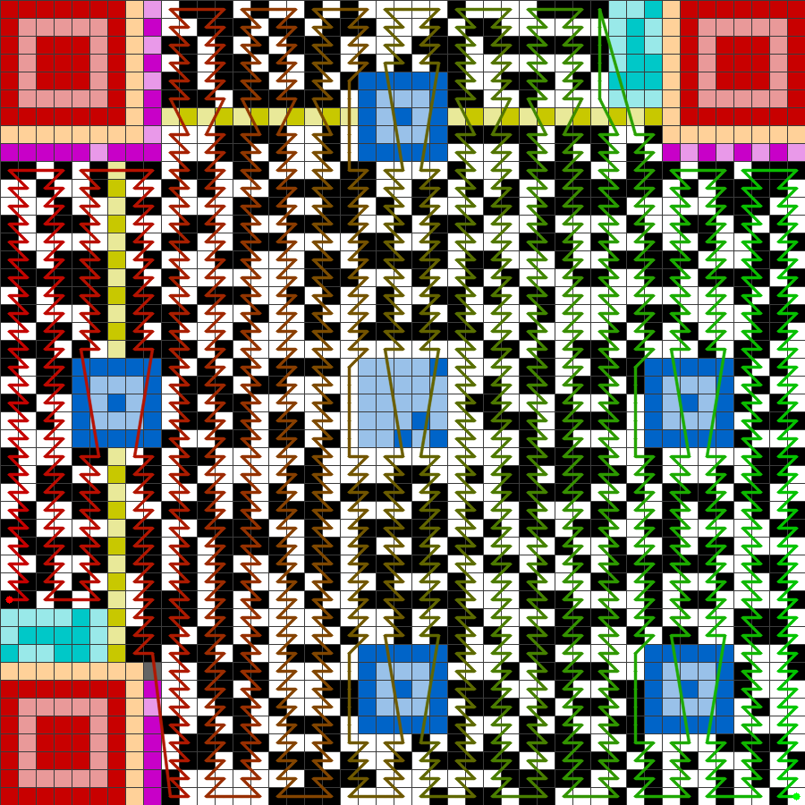
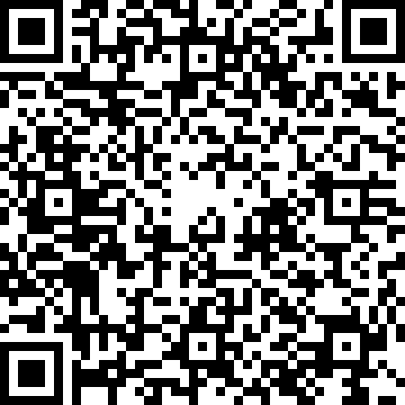

# qr_decoder

全 AI 编码, 不依赖任何高级库(除了图片读写, 以及常规的 opencv 操作)

单纯为学习 QR 解码怎么做. ai 的解法不一定和实际的一样, 但是鉴于大体可工作, 所以可认为这就是典型的做法.

怎么解码: 见 https://github.com/superzhangmch/qr_decoder/blob/main/qr_decode_explained.md 

----

网上随便找一个 QR code, 中间步骤如下: 

  

   
  
取 XOR 后:  
   
 
